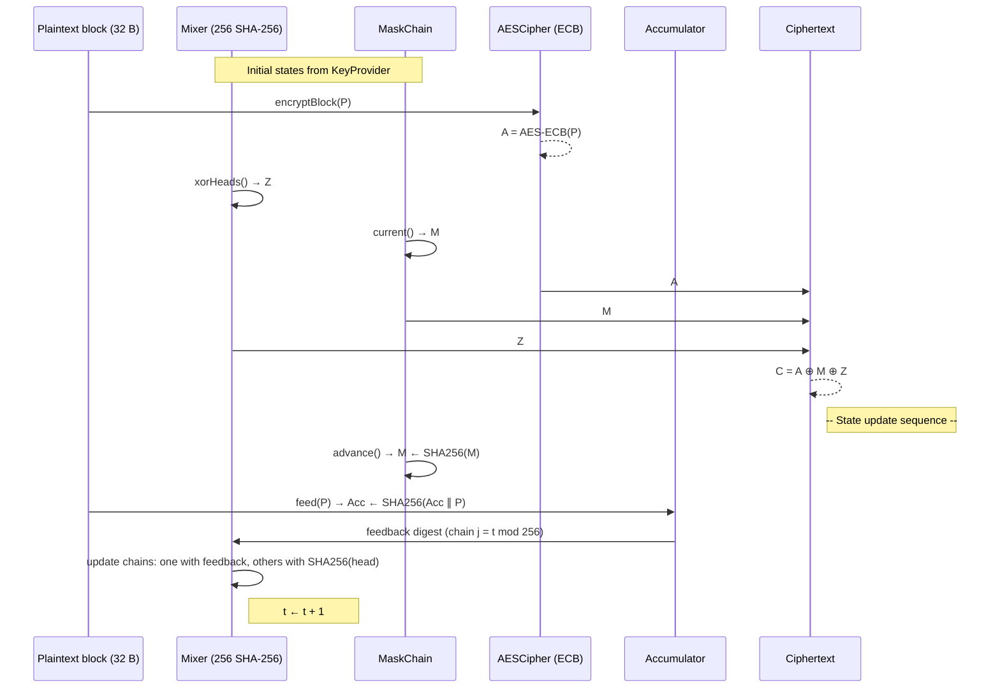

# StreamCrypt Library — Complete Specification, Diagram & Animation

## Part 1: Full TypeScript Class Specifications

```typescript
// ============================================================================
// StreamCrypt Library — TypeScript Class Specifications (KeyProvider inj.)
// ============================================================================

// ----------------------------------------------------------------------------
// 1. Cryptographic Primitives
// ----------------------------------------------------------------------------

/**
 * Interface for a SHA‑256 hash engine.
 * Each component that needs hashing will create a fresh instance via a factory.
 */
interface IHashEngine {
  reset(): void;
  update(data: Uint8Array): void;
  /**
   * Consumes the engine and returns the 32‑byte digest.
   * The engine MUST NOT be used after final() is called.
   */
  final(): Uint8Array;
}

// ----------------------------------------------------------------------------
// 2. Key Material Abstraction
// ----------------------------------------------------------------------------

/**
 * Provides true‑random key material from an underlying source (e.g., QRNG).
 * Tracks the offset to ensure no reuse.
 */
interface KeyProvider {
  /**
   * @param length Number of bytes requested.
   * @returns An object containing:
   *   - offset: the starting position in the global key stream (64‑bit unsigned)
   *   - used:   the number of bytes actually returned (always == length)
   *   - material: a Uint8Array of length `used` containing the raw bytes.
   */
  getKey(length: number): {
    offset: bigint;
    used: number;
    material: Uint8Array;
  };
}

// ----------------------------------------------------------------------------
// 3. PlaintextAccumulator
// ----------------------------------------------------------------------------

/**
 * Running SHA‑256 hash over the *entire* plaintext stream.
 * Its current digest is used as feedback into one chain of the Mixer per block.
 */
class PlaintextAccumulator {
  /** 32‑byte current accumulator state */
  private state: Uint8Array;

  /** Factory for creating a fresh SHA‑256 engine */
  private hashFactory: () => IHashEngine;

  /**
   * @param keyProvider  Reads 32 bytes to seed the accumulator.
   * @param hashFactory  Factory function that returns a new IHashEngine instance.
   */
  constructor(keyProvider: KeyProvider, hashFactory: () => IHashEngine) {
    const { material } = keyProvider.getKey(32);
    this.state = material;
    this.hashFactory = hashFactory;
  }

  /**
   * Returns a *copy* of the current digest (32 bytes).
   */
  current(): Uint8Array {
    return this.state.slice();
  }

  /**
   * Updates the accumulator with a plaintext block:
   *   state ← SHA‑256(state || plaintextBlock)
   * @param plaintextBlock  Exactly 32 bytes of plaintext.
   */
  feed(plaintextBlock: Uint8Array): void {
    const h = this.hashFactory();
    h.update(this.state);
    h.update(plaintextBlock);
    this.state = h.final();
  }
}

// ----------------------------------------------------------------------------
// 4. MaskChain
// ----------------------------------------------------------------------------

/**
 * Independent hash chain that supplies a fresh 32‑byte mask for every block.
 * This mask is XORed with the AES output to simulate a unique IV per block.
 */
class MaskChain {
  /** Current mask value (32 bytes) */
  private state: Uint8Array;

  /** Factory for SHA‑256 engines */
  private hashFactory: () => IHashEngine;

  /**
   * @param keyProvider  Reads 32 bytes for the initial seed.
   * @param hashFactory  Factory for SHA‑256 engines.
   */
  constructor(keyProvider: KeyProvider, hashFactory: () => IHashEngine) {
    const { material } = keyProvider.getKey(32);
    this.state = material;
    this.hashFactory = hashFactory;
  }

  /**
   * Returns a *copy* of the current mask (32 bytes).
   */
  current(): Uint8Array {
    return this.state.slice();
  }

  /**
   * Advances the chain: state ← SHA‑256(state).
   * Must be called after the current mask has been consumed.
   */
  advance(): void {
    const h = this.hashFactory();
    h.update(this.state);
    this.state = h.final();
  }
}

// ----------------------------------------------------------------------------
// 5. AESCipher (256‑bit key, ECB on two 128‑bit halves)
// ----------------------------------------------------------------------------

/**
 * AES‑256 encryption / decryption, operating on 32‑byte blocks.
 * Internally splits the block into two 128‑bit halves and applies AES in
 * Electronic Codebook (ECB) mode. The ECB vulnerability is fully mitigated
 * by the unique 32‑byte mask applied to every block in the StreamProcessor.
 */
class AESCipher {
  /** Raw AES‑256 key (32 bytes) */
  private key: Uint8Array;

  /**
   * @param keyProvider  Reads 32 bytes for the AES‑256 key.
   */
  constructor(keyProvider: KeyProvider) {
    const { material } = keyProvider.getKey(32);
    this.key = material;
  }

  /**
   * Encrypts a 32‑byte plaintext block.
   * @param plaintext  32 bytes.
   * @returns 32 bytes of AES ciphertext (ECB on two 128‑bit halves).
   */
  encryptBlock(plaintext: Uint8Array): Uint8Array {
    // Split into two 16‑byte halves
    const left = plaintext.slice(0, 16);
    const right = plaintext.slice(16, 32);
    // AES‑ECB encrypt each half (replace with actual AES call)
    const ctLeft = this.aesEncrypt(left);
    const ctRight = this.aesEncrypt(right);
    const result = new Uint8Array(32);
    result.set(ctLeft, 0);
    result.set(ctRight, 16);
    return result;
  }

  /**
   * Decrypts a 32‑byte ciphertext block.
   * @param ciphertext  32 bytes.
   * @returns 32 bytes of original plaintext.
   */
  decryptBlock(ciphertext: Uint8Array): Uint8Array {
    const left = ciphertext.slice(0, 16);
    const right = ciphertext.slice(16, 32);
    const ptLeft = this.aesDecrypt(left);
    const ptRight = this.aesDecrypt(right);
    const result = new Uint8Array(32);
    result.set(ptLeft, 0);
    result.set(ptRight, 16);
    return result;
  }

  // Placeholder for actual AES encryption (must be implemented using a library)
  private aesEncrypt(block: Uint8Array): Uint8Array {
    // In real code: use Web Crypto or a pure‑JS AES implementation
    throw new Error("Not implemented – replace with actual AES‑256 ECB");
  }

  private aesDecrypt(block: Uint8Array): Uint8Array {
    throw new Error("Not implemented – replace with actual AES‑256 ECB");
  }
}

// ----------------------------------------------------------------------------
// 6. Mixer (256 parallel SHA‑256 chains)
// ----------------------------------------------------------------------------

/**
 * 256 independently seeded SHA‑256 chains whose heads are XORed together
 * to produce a 32‑byte keystream block. One chain per block receives a
 * plaintext‑derived feedback value selected round‑robin.
 */
class Mixer {
  /**
   * Flat array of 256 × 32 bytes = 8192 bytes.
   * The i‑th chain's current head is at offset i*32.
   */
  private heads: Uint8Array;

  /** SHA‑256 factory */
  private hashFactory: () => IHashEngine;

  /**
   * @param keyProvider  Reads 8192 bytes to seed the 256 chain heads.
   * @param hashFactory  Factory for SHA‑256 engines.
   */
  constructor(keyProvider: KeyProvider, hashFactory: () => IHashEngine) {
    const { material } = keyProvider.getKey(8192);
    this.heads = material; // exactly 8192 bytes
    this.hashFactory = hashFactory;
  }

  /**
   * Computes the XOR of all 256 current chain heads.
   * @returns A new 32‑byte Uint8Array.
   */
  xorHeads(): Uint8Array {
    const result = new Uint8Array(32);
    for (let i = 0; i < 256; i++) {
      const off = i * 32;
      for (let j = 0; j < 32; j++) {
        result[j] ^= this.heads[off + j];
      }
    }
    return result;
  }

  /**
   * Advances *all* 256 chains by one hash step.
   * For the chain at `chainIndex`, the new head is:
   *   SHA‑256(currentHead || feedback)
   * For all other chains:
   *   SHA‑256(currentHead)
   *
   * @param feedback     32‑byte value from the PlaintextAccumulator.
   * @param chainIndex   Which chain receives the feedback (0…255).
   */
  update(feedback: Uint8Array, chainIndex: number): void {
    const newHeads = new Uint8Array(8192);
    for (let i = 0; i < 256; i++) {
      const off = i * 32;
      const oldHead = this.heads.slice(off, off + 32);
      const h = this.hashFactory();
      if (i === chainIndex) {
        h.update(oldHead);
        h.update(feedback);
      } else {
        h.update(oldHead);
      }
      const newHead = h.final();
      newHeads.set(newHead, off);
    }
    this.heads = newHeads;
  }
}

// ----------------------------------------------------------------------------
// 7. StreamProcessor (Orchestrator)
// ----------------------------------------------------------------------------

/**
 * Main entry point for stream encryption / decryption.
 * Wires together the PlaintextAccumulator, MaskChain, AESCipher, and Mixer.
 * All calls to encryptBlock / decryptBlock must be on 32‑byte boundaries,
 * in strict sequential order. No padding is performed by the library.
 */
class StreamProcessor {
  private accumulator: PlaintextAccumulator;
  private mask: MaskChain;
  private aes: AESCipher;
  private mixer: Mixer;

  /** Number of 32‑byte blocks processed so far */
  private blockCounter: number;

  /**
   * Initialises all sub‑components by consuming the required key material
   * from the supplied KeyProvider.
   *
   * @param keyProvider  Must contain at least 8 288 unused bytes.
   * @param hashFactory  SHA‑256 factory used throughout.
   */
  constructor(keyProvider: KeyProvider, hashFactory: () => IHashEngine) {
    // The order MUST be: Accumulator, Mask, AES, Mixer
    this.accumulator = new PlaintextAccumulator(keyProvider, hashFactory);
    this.mask = new MaskChain(keyProvider, hashFactory);
    this.aes = new AESCipher(keyProvider);
    this.mixer = new Mixer(keyProvider, hashFactory);
    this.blockCounter = 0;
  }

  /**
   * Encrypt a 32‑byte plaintext block.
   *
   * Processing steps:
   *   Z = mixer.xorHeads()
   *   M = mask.current()
   *   A = aes.encryptBlock(P)
   *   C = A XOR M XOR Z
   *
   * Then updates state: mask.advance(), accumulator.feed(P),
   * mixer.update( accumulator.current(), blockCounter mod 256 ),
   * blockCounter++.
   *
   * @param plaintext  32 bytes of plaintext.
   * @returns 32 bytes of ciphertext.
   */
  encryptBlock(plaintext: Uint8Array): Uint8Array {
    const Z = this.mixer.xorHeads();
    const M = this.mask.current();
    const A = this.aes.encryptBlock(plaintext);
    const C = new Uint8Array(32);
    for (let i = 0; i < 32; i++) {
      C[i] = A[i] ^ M[i] ^ Z[i];
    }

    // State updates in exact order
    this.mask.advance();
    this.accumulator.feed(plaintext);
    const feedback = this.accumulator.current();
    this.mixer.update(feedback, this.blockCounter % 256);
    this.blockCounter++;

    return C;
  }

  /**
   * Decrypt a 32‑byte ciphertext block.
   *
   * Processing steps:
   *   Z = mixer.xorHeads()
   *   M = mask.current()
   *   A = C XOR M XOR Z
   *   P = aes.decryptBlock(A)
   *
   * Updates state identically to encryption.
   *
   * @param ciphertext  32 bytes of ciphertext.
   * @returns 32 bytes of plaintext.
   */
  decryptBlock(ciphertext: Uint8Array): Uint8Array {
    const Z = this.mixer.xorHeads();
    const M = this.mask.current();
    const A = new Uint8Array(32);
    for (let i = 0; i < 32; i++) {
      A[i] = ciphertext[i] ^ M[i] ^ Z[i];
    }
    const P = this.aes.decryptBlock(A);

    // Identical state updates
    this.mask.advance();
    this.accumulator.feed(P);
    const feedback = this.accumulator.current();
    this.mixer.update(feedback, this.blockCounter % 256);
    this.blockCounter++;

    return P;
  }
}
```

---

## Part 2: Mermaid State Machine Diagram



---

## Part 3: Full Manim Animation Script

Save as `streamcrypt_animation.py` and run with `manim -pql streamcrypt_animation.py StreamCryptAnimation`.

```python
from manim import *
import numpy as np

class StreamCryptAnimation(Scene):
    def construct(self):
        # ------------------------------------------------
        # Scaling / layout constants
        # ------------------------------------------------
        self.camera.background_color = "#1e1e1e"

        # Component positions
        acc_pos   = LEFT * 5 + UP * 2.5
        mask_pos  = LEFT * 5 + UP * 0.0
        aes_pos   = LEFT * 5 + DOWN * 2.5
        mixer_pos = RIGHT * 2 + UP * 0.0
        key_pos   = LEFT * 5 + UP * 5.5

        # ------------------------------------------------
        #  Helper: create a small 8x4 grid for the Mixer
        # ------------------------------------------------
        def create_mixer_grid():
            """Returns a VGroup of 32 tiny rectangles (8 col x 4 row)."""
            grid = VGroup()
            for row in range(4):
                for col in range(8):
                    cell = Square(side_length=0.25, stroke_width=0.5,
                                  stroke_color=GRAY, fill_opacity=0.8)
                    cell.move_to(mixer_pos + RIGHT*(col-3.5)*0.3 + DOWN*(row-1.5)*0.3)
                    grid.add(cell)
            return grid

        # ------------------------------------------------
        #  Helper: create a 32‑byte block visual
        # ------------------------------------------------
        def block_rect(label_text, color=BLUE, position=ORIGIN, width=1.5, height=0.8):
            rect = Rectangle(width=width, height=height, color=color, fill_opacity=0.3)
            label = Text(label_text, font_size=20, color=color).move_to(rect)
            group = VGroup(rect, label).move_to(position)
            return group

        # ================================================
        # SCENE 1: Initialisation — Key distribution
        # ================================================

        # KeyProvider box
        key_box = Rectangle(width=3.5, height=1.2, color=WHITE, fill_opacity=0.2)
        key_label = Text("QRNG Key Material", font_size=22, color=WHITE).move_to(key_box)
        key_group = VGroup(key_box, key_label).move_to(key_pos)
        self.play(FadeIn(key_group))

        # Component placeholders
        acc_box = block_rect("Accumulator", BLUE, acc_pos)
        mask_box = block_rect("Mask Chain", GREEN, mask_pos)
        aes_box = block_rect("AES", RED, aes_pos)
        mixer_box = block_rect("Mixer (256 chains)", ORANGE, mixer_pos)
        self.play(FadeIn(acc_box), FadeIn(mask_box), FadeIn(aes_box), FadeIn(mixer_box))

        # The mixer grid
        mixer_grid = create_mixer_grid()
        self.play(FadeIn(mixer_grid))

        # Now animate key flows
        # Accumulator seed
        acc_seed_arrow = Arrow(key_box.get_bottom(), acc_box.get_top(), buff=0.2, color=BLUE)
        acc_seed_text = Text("32 B", font_size=16, color=BLUE).next_to(acc_seed_arrow, RIGHT, buff=0.1)
        self.play(GrowArrow(acc_seed_arrow), Write(acc_seed_text))
        self.play(acc_box[0].animate.set_fill(BLUE, opacity=0.5))
        self.wait(0.3)
        self.play(FadeOut(acc_seed_arrow), FadeOut(acc_seed_text))

        # Mask seed
        mask_seed_arrow = Arrow(key_box.get_bottom(), mask_box.get_top(), buff=0.2, color=GREEN)
        mask_seed_text = Text("32 B", font_size=16, color=GREEN).next_to(mask_seed_arrow, RIGHT, buff=0.1)
        self.play(GrowArrow(mask_seed_arrow), Write(mask_seed_text))
        self.play(mask_box[0].animate.set_fill(GREEN, opacity=0.5))
        self.wait(0.3)
        self.play(FadeOut(mask_seed_arrow), FadeOut(mask_seed_text))

        # AES key
        aes_key_arrow = Arrow(key_box.get_bottom(), aes_box.get_top(), buff=0.2, color=RED)
        aes_key_text = Text("32 B", font_size=16, color=RED).next_to(aes_key_arrow, RIGHT, buff=0.1)
        self.play(GrowArrow(aes_key_arrow), Write(aes_key_text))
        self.play(aes_box[0].animate.set_fill(RED, opacity=0.5))
        self.wait(0.3)
        self.play(FadeOut(aes_key_arrow), FadeOut(aes_key_text))

        # Mixer seeds (8192 B)
        mixer_key_arrow = Arrow(key_box.get_bottom(), mixer_box.get_top(), buff=0.2, color=ORANGE)
        mixer_key_text = Text("8192 B", font_size=16, color=ORANGE).next_to(mixer_key_arrow, RIGHT, buff=0.1)
        self.play(GrowArrow(mixer_key_arrow), Write(mixer_key_text))
        # Flash the mixer grid cells
        self.play(LaggedStart(*[cell.animate.set_fill(YELLOW, opacity=0.7) for cell in mixer_grid], lag_ratio=0.02, run_time=1.5))
        self.play(LaggedStart(*[cell.animate.set_fill(ORANGE, opacity=0.4) for cell in mixer_grid], lag_ratio=0.02, run_time=0.5))
        self.wait(0.3)
        self.play(FadeOut(mixer_key_arrow), FadeOut(mixer_key_text))

        # Show "Ready" labels
        ready_labels = VGroup(
            Text("Ready", font_size=16, color=BLUE).next_to(acc_box, DOWN, buff=0.1),
            Text("Ready", font_size=16, color=GREEN).next_to(mask_box, DOWN, buff=0.1),
            Text("Ready", font_size=16, color=RED).next_to(aes_box, DOWN, buff=0.1),
            Text("Ready", font_size=16, color=ORANGE).next_to(mixer_box, DOWN, buff=0.1)
        )
        self.play(Write(ready_labels))
        self.wait(1)

        # Remove ready labels and key box to save space
        self.play(FadeOut(ready_labels), FadeOut(key_group))

        # ================================================
        # SCENE 2: Process first plaintext block (t=0)
        # ================================================

        # Current chain index indicator
        chain_idx_text = Text("Chain index: 0", font_size=18, color=YELLOW).to_corner(UR)
        self.play(Write(chain_idx_text))

        # Plaintext block P0 appears on the left
        p0_box = block_rect("P₀", YELLOW, position=LEFT*5 + DOWN*5)
        self.play(FadeIn(p0_box))

        # Step 1: Mixer XOR all heads → Z0
        mixer_grid.save_state()
        self.play(mixer_grid.animate.set_stroke(color=YELLOW, width=1))
        z0_box = block_rect("Z₀", CYAN, position=mixer_pos + RIGHT*2.5)
        xor_arrow = Arrow(mixer_box.get_right(), z0_box.get_left(), color=CYAN, buff=0.2)
        self.play(GrowArrow(xor_arrow), FadeIn(z0_box))
        self.wait(0.3)
        self.play(FadeOut(xor_arrow))
        self.play(mixer_grid.animate.restore())

        # Step 2: AES encryption of P0
        a0_half1 = block_rect("A₀[0]", PINK, position=aes_pos + RIGHT*2.0 + UP*0.3, width=1.2, height=0.6)
        a0_half2 = block_rect("A₀[1]", PINK, position=aes_pos + RIGHT*2.0 + DOWN*0.3, width=1.2, height=0.6)
        aes_arrow = Arrow(p0_box.get_top(), aes_box.get_bottom(), color=RED, buff=0.2)
        self.play(GrowArrow(aes_arrow), FadeIn(a0_half1), FadeIn(a0_half2))
        self.wait(0.3)
        self.play(FadeOut(aes_arrow))

        # Combine to A0
        a0_full = block_rect("A₀", RED, position=aes_pos + RIGHT*4.0)
        combine_arrows = [
            Arrow(a0_half1.get_right(), a0_full.get_left(), color=RED, buff=0.1),
            Arrow(a0_half2.get_right(), a0_full.get_left(), color=RED, buff=0.1)
        ]
        self.play(*[GrowArrow(a) for a in combine_arrows], FadeIn(a0_full))
        self.wait(0.2)
        self.play(FadeOut(a0_half1), FadeOut(a0_half2), *[FadeOut(a) for a in combine_arrows])

        # Step 3: Mask current() → M0
        m0_box = block_rect("M₀", GREEN, position=mask_pos + RIGHT*2.5)
        mask_arrow = Arrow(mask_box.get_right(), m0_box.get_left(), color=GREEN, buff=0.2)
        self.play(GrowArrow(mask_arrow), FadeIn(m0_box))
        self.wait(0.3)
        self.play(FadeOut(mask_arrow))

        # Step 4: Ciphertext C0 = A0 ⊕ M0 ⊕ Z0
        xor_gate = block_rect("⊕", GREY, position=RIGHT*0.5 + DOWN*5, width=0.8, height=0.8)
        # Bring all three to XOR gate
        arrows_to_xor = [
            Arrow(a0_full.get_bottom(), xor_gate.get_left(), color=RED, buff=0.2),
            Arrow(m0_box.get_bottom(), xor_gate.get_top(), color=GREEN, buff=0.2),
            Arrow(z0_box.get_bottom(), xor_gate.get_right(), color=CYAN, buff=0.2)
        ]
        self.play(
            FadeIn(xor_gate),
            *[GrowArrow(a) for a in arrows_to_xor]
        )
        c0_box = block_rect("C₀", GREY, position=xor_gate.get_bottom() + DOWN*0.8)
        c0_arrow = Arrow(xor_gate.get_bottom(), c0_box.get_top(), color=GREY, buff=0.2)
        self.play(GrowArrow(c0_arrow), FadeIn(c0_box))
        self.wait(0.5)

        # Clean up intermediate blocks (A0, M0, Z0, arrows)
        self.play(
            FadeOut(a0_full), FadeOut(m0_box), FadeOut(z0_box),
            FadeOut(xor_gate), FadeOut(c0_arrow),
            *[FadeOut(a) for a in arrows_to_xor]
        )

        # ================================================
        # STATE UPDATE SEQUENCE (after P0)
        # ================================================
        # 1. Mask advance()
        self.play(mask_box[0].animate.set_fill(GREEN, opacity=1))
        mask_adv_label = Text("advance()", font_size=14, color=GREEN).next_to(mask_box, RIGHT, buff=0.1)
        self.play(Write(mask_adv_label))
        # Simulate state change: flash
        self.play(mask_box[0].animate.set_fill(WHITE, opacity=0.5), run_time=0.3)
        self.play(mask_box[0].animate.set_fill(GREEN, opacity=0.6), run_time=0.3)
        self.play(FadeOut(mask_adv_label))

        # 2. Accumulator feed(P0)
        acc_feed_arrow = Arrow(p0_box.get_right(), acc_box.get_bottom(), color=BLUE, buff=0.2)
        self.play(GrowArrow(acc_feed_arrow))
        self.play(acc_box[0].animate.set_fill(BLUE, opacity=1))
        acc_label = Text("feed(P₀)", font_size=14, color=BLUE).next_to(acc_box, RIGHT, buff=0.1)
        self.play(Write(acc_label))
        self.play(acc_box[0].animate.set_fill(WHITE, opacity=0.5), run_time=0.3)
        self.play(acc_box[0].animate.set_fill(BLUE, opacity=0.6), run_time=0.3)
        self.play(FadeOut(acc_feed_arrow), FadeOut(acc_label))

        # 3. Mixer update(Acc₁, chain 0)
        mixer_update_arrow = Arrow(acc_box.get_right(), mixer_box.get_top(), color=BLUE, buff=0.2)
        mixer_update_label = Text("Acc₁ → chain 0", font_size=14, color=BLUE).next_to(mixer_update_arrow, RIGHT, buff=0.1)
        self.play(GrowArrow(mixer_update_arrow), Write(mixer_update_label))
        # Highlight chain 0 cell (first cell in grid)
        chain0_cell = mixer_grid[0]
        self.play(chain0_cell.animate.set_fill(BLUE, opacity=1), run_time=0.3)
        # Flash all cells to show hash update
        self.play(
            LaggedStart(*[cell.animate.set_fill(ORANGE, opacity=0.8) for cell in mixer_grid],
                        lag_ratio=0.01, run_time=1),
            chain0_cell.animate.set_fill(BLUE, opacity=1)
        )
        self.play(
            LaggedStart(*[cell.animate.set_fill(ORANGE, opacity=0.4) for cell in mixer_grid],
                        lag_ratio=0.01, run_time=0.5)
        )
        self.play(FadeOut(mixer_update_arrow), FadeOut(mixer_update_label))

        # Update counter
        self.play(chain_idx_text.animate.become(Text("Chain index: 1", font_size=18, color=YELLOW).to_corner(UR)))
        self.wait(0.5)

        # Remove C0 and P0 for next block
        self.play(FadeOut(c0_box), FadeOut(p0_box))

        # ================================================
        # SCENE 3: Second block (t=1) — similar, but faster
        # ================================================
        p1_box = block_rect("P₁", YELLOW, position=LEFT*5 + DOWN*5)
        self.play(FadeIn(p1_box))

        # Z1
        mixer_grid.save_state()
        self.play(mixer_grid.animate.set_stroke(color=YELLOW, width=1))
        z1_box = block_rect("Z₁", CYAN, position=mixer_pos + RIGHT*2.5)
        xor_arrow = Arrow(mixer_box.get_right(), z1_box.get_left(), color=CYAN, buff=0.2)
        self.play(GrowArrow(xor_arrow), FadeIn(z1_box))
        self.play(FadeOut(xor_arrow), mixer_grid.animate.restore())

        # AES
        a1_half1 = block_rect("A₁[0]", PINK, position=aes_pos + RIGHT*2.0 + UP*0.3, width=1.2, height=0.6)
        a1_half2 = block_rect("A₁[1]", PINK, position=aes_pos + RIGHT*2.0 + DOWN*0.3, width=1.2, height=0.6)
        aes_arrow = Arrow(p1_box.get_top(), aes_box.get_bottom(), color=RED, buff=0.2)
        self.play(GrowArrow(aes_arrow), FadeIn(a1_half1), FadeIn(a1_half2))
        self.wait(0.2)
        self.play(FadeOut(aes_arrow))
        a1_full = block_rect("A₁", RED, position=aes_pos + RIGHT*4.0)
        combine_arrows = [
            Arrow(a1_half1.get_right(), a1_full.get_left(), color=RED, buff=0.1),
            Arrow(a1_half2.get_right(), a1_full.get_left(), color=RED, buff=0.1)
        ]
        self.play(*[GrowArrow(a) for a in combine_arrows], FadeIn(a1_full))
        self.play(FadeOut(a1_half1), FadeOut(a1_half2), *[FadeOut(a) for a in combine_arrows])

        # M1
        m1_box = block_rect("M₁", GREEN, position=mask_pos + RIGHT*2.5)
        mask_arrow = Arrow(mask_box.get_right(), m1_box.get_left(), color=GREEN, buff=0.2)
        self.play(GrowArrow(mask_arrow), FadeIn(m1_box))
        self.play(FadeOut(mask_arrow))

        # XOR
        xor_gate = block_rect("⊕", GREY, position=RIGHT*0.5 + DOWN*5, width=0.8, height=0.8)
        arrows_to_xor = [
            Arrow(a1_full.get_bottom(), xor_gate.get_left(), color=RED, buff=0.2),
            Arrow(m1_box.get_bottom(), xor_gate.get_top(), color=GREEN, buff=0.2),
            Arrow(z1_box.get_bottom(), xor_gate.get_right(), color=CYAN, buff=0.2)
        ]
        self.play(FadeIn(xor_gate), *[GrowArrow(a) for a in arrows_to_xor])
        c1_box = block_rect("C₁", GREY, position=xor_gate.get_bottom() + DOWN*0.8)
        c1_arrow = Arrow(xor_gate.get_bottom(), c1_box.get_top(), color=GREY, buff=0.2)
        self.play(GrowArrow(c1_arrow), FadeIn(c1_box))
        self.play(
            FadeOut(a1_full), FadeOut(m1_box), FadeOut(z1_box),
            FadeOut(xor_gate), FadeOut(c1_arrow),
            *[FadeOut(a) for a in arrows_to_xor]
        )

        # State updates — Mask advance
        self.play(mask_box[0].animate.set_fill(GREEN, opacity=1))
        mask_adv_label = Text("advance()", font_size=14, color=GREEN).next_to(mask_box, RIGHT, buff=0.1)
        self.play(Write(mask_adv_label))
        self.play(mask_box[0].animate.set_fill(WHITE, opacity=0.5), run_time=0.2)
        self.play(mask_box[0].animate.set_fill(GREEN, opacity=0.6), run_time=0.2)
        self.play(FadeOut(mask_adv_label))

        # Accumulator feed
        acc_feed_arrow = Arrow(p1_box.get_right(), acc_box.get_bottom(), color=BLUE, buff=0.2)
        self.play(GrowArrow(acc_feed_arrow))
        acc_label = Text("feed(P₁)", font_size=14, color=BLUE).next_to(acc_box, RIGHT, buff=0.1)
        self.play(Write(acc_label))
        self.play(acc_box[0].animate.set_fill(WHITE, opacity=0.5), run_time=0.2)
        self.play(acc_box[0].animate.set_fill(BLUE, opacity=0.6), run_time=0.2)
        self.play(FadeOut(acc_feed_arrow), FadeOut(acc_label))

        # Mixer update chain 1
        mixer_update_arrow = Arrow(acc_box.get_right(), mixer_box.get_top(), color=BLUE, buff=0.2)
        mixer_update_label = Text("Acc₂ → chain 1", font_size=14, color=BLUE).next_to(mixer_update_arrow, RIGHT, buff=0.1)
        self.play(GrowArrow(mixer_update_arrow), Write(mixer_update_label))
        chain1_cell = mixer_grid[1]
        self.play(chain1_cell.animate.set_fill(BLUE, opacity=1), run_time=0.3)
        self.play(
            LaggedStart(*[cell.animate.set_fill(ORANGE, opacity=0.8) for cell in mixer_grid],
                        lag_ratio=0.01, run_time=0.8),
            chain1_cell.animate.set_fill(BLUE, opacity=1)
        )
        self.play(
            LaggedStart(*[cell.animate.set_fill(ORANGE, opacity=0.4) for cell in mixer_grid],
                        lag_ratio=0.01, run_time=0.3)
        )
        self.play(FadeOut(mixer_update_arrow), FadeOut(mixer_update_label))
        self.play(chain_idx_text.animate.become(Text("Chain index: 2", font_size=18, color=YELLOW).to_corner(UR)))

        self.wait(0.5)
        self.play(FadeOut(c1_box), FadeOut(p1_box))

        # ================================================
        # SCENE 4: Time‑lapse 256‑block cycle
        # ================================================
        # Simplify: just cycle through chain indices 2..255, updating mix grid
        # Show a counter and highlight each chain one by one.

        cycle_label = Text("Cycling 256 blocks...", font_size=20, color=WHITE).to_corner(UL)
        self.play(Write(cycle_label))

        for t in range(2, 256):
            # Update chain index text efficiently
            new_chain_text = Text(f"Chain index: {t}", font_size=18, color=YELLOW).to_corner(UR)
            self.remove(chain_idx_text)
            chain_idx_text = new_chain_text
            self.add(chain_idx_text)

            # Highlight the current chain cell
            if t < len(mixer_grid):  # grid has 32 cells, cycle virtual chain index modulo grid size visually
                cell = mixer_grid[t % len(mixer_grid)]
                self.play(cell.animate.set_fill(BLUE, opacity=1), run_time=0.05)
                self.play(cell.animate.set_fill(ORANGE, opacity=0.5), run_time=0.05)
            else:
                # For indices beyond grid visual, just flash the mixer box
                self.play(mixer_box[0].animate.set_fill(BLUE, opacity=0.3), run_time=0.05)
                self.play(mixer_box[0].animate.set_fill(ORANGE, opacity=0.2), run_time=0.05)

        # After cycle, show "Cycle complete"
        complete_msg = Text("256‑block cycle complete\nAll chains touched", font_size=20, color=GREEN).move_to(DOWN*3)
        self.play(Write(complete_msg))
        self.wait(2)
        self.play(FadeOut(complete_msg), FadeOut(cycle_label), FadeOut(chain_idx_text))

        # Fade out everything
        self.play(FadeOut(mixer_grid), FadeOut(acc_box), FadeOut(mask_box),
                  FadeOut(aes_box), FadeOut(mixer_box))
        self.wait(0.5)
```
